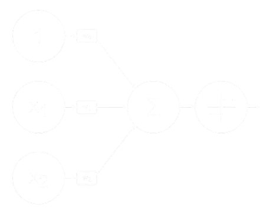
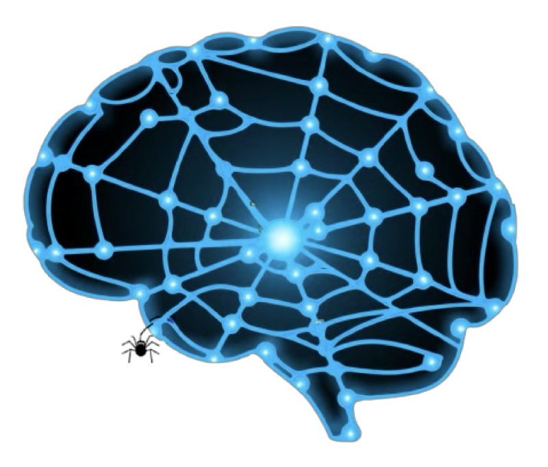
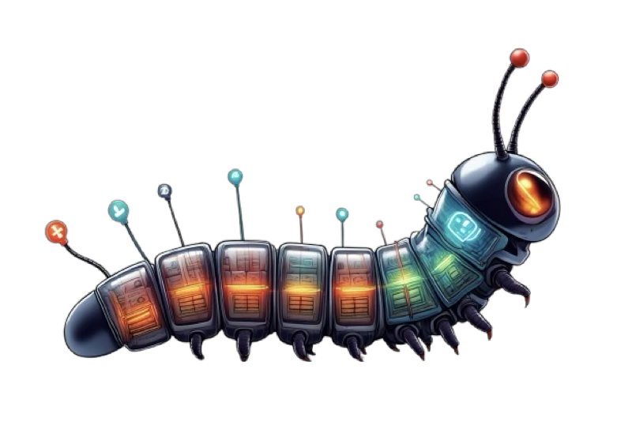
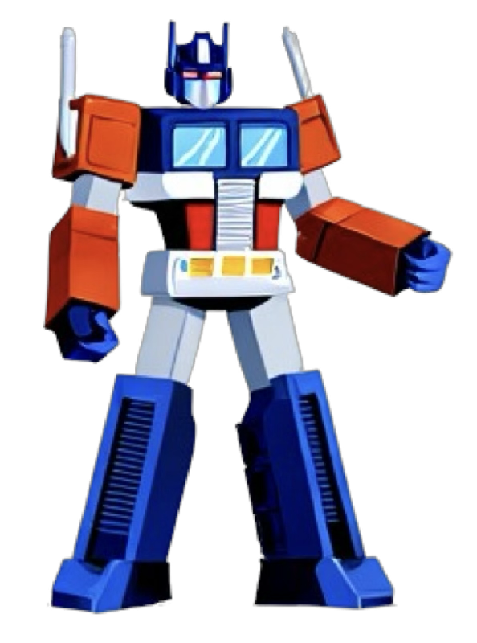
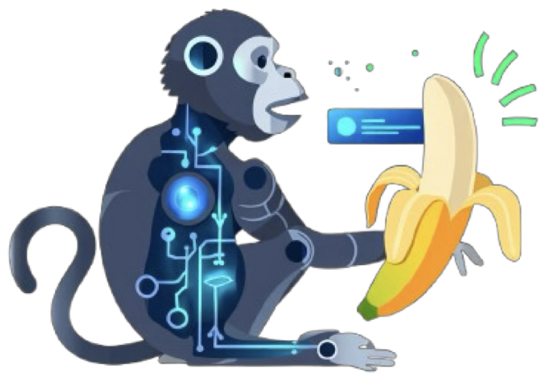

# KI-Glossar

Ein kompakter Überblick über zentrale KI-Architekturen und Lernformen, mit Stärken und typischen Einsatzmöglichkeiten.

---

## Generelle Stärken von KI-Systemen
- Verarbeiten große Mengen an Daten effizient  
- Lernen aus Beispielen statt Regeln  
- Erkennen verborgene Muster oder Strukturen  
- Arbeiten rund um die Uhr (z. B. als Assistenten)  
- Unterstützen kreative Prozesse mit Vorschlägen oder Varianten  
- Machen Vorschläge, ohne zu bewerten oder zu kritisieren  

## Architekturen

| Architektur | Kurzbeschreibung | Individuelle Stärken & Besonderheiten |
|------------|------------------|---------------------------|
|  | **Perceptron** | Einfachste Form eines künstlichen Neurons. Grundlage für komplexere Netzwerke.   - Löst linear trennbare Probleme  - Sehr verständlich, ideal für Einstiege |
|  | **MLP (Multilayer Perceptron)** | Mehrschichtige Netze aus Perceptrons. Können komplexe nichtlineare Zusammenhänge lernen.  - Vielseitig & robust  - Für strukturierte Daten geeignet  - Lernen durch Beispiele statt Regeln |
|  | **CNN (Convolutional Neural Network)** | Arbeitet mit Faltungen – stark bei visuellen oder räumlich strukturierten Daten.  - Erkennen Muster, Positionen & Kanten  - Sehr gut für Notenbilder & Spektrogramme  - Filtern wichtige Informationen automatisch |
|  | **Autoencoder** | Lernen, Daten kompakt zu repräsentieren (Kompression + Rekonstruktion).  - Feature-Extraktion & Anomalie-Erkennung  - Datenvereinfachung & Vorverarbeitung  - Können Varianten aus bekannten Daten erzeugen |
|  | **RNN (Recurrent Neural Network)** | Speichert frühere Eingaben im Speicherzustand – ideal für Sequenzen.  - Modelliert zeitliche Abfolgen (z. B. Melodien, Sprache)  - Hat ein „Gedächtnis“  - Gute Wahl für kontextabhängige Vorhersagen |
|  | **Transformer** | Nutzt Selbstaufmerksamkeit („Attention“) statt Zustandsweitergabe über Zeit.  - Erkennt globale Zusammenhänge  - Verarbeitet Eingaben parallel  - Besonders stark bei längeren Texten oder Musikstücken |
|  | **Reinforcement Learning (RL)** | Agent lernt durch Belohnung/Bestrafung – wie in einem Spiel.  - Entwickelt eigene Strategien durch Feedback  - Eignet sich für interaktive & explorative Szenarien  - Kann selbstständig lernen (z. B. durch „Self-Play“) |
|  | **GANs (Generative Adversarial Networks)** | Zwei Netzwerke „kämpfen“ miteinander: Generator vs. Critic.  - Erzeugen neue & realistische Inhalte  - Lernen den Stil von Beispielen  - Fördern kreative & experimentelle Anwendungen |
|  | **Diffusion Models** | Lernen, Daten schrittweise zu „ent-rauschen“, um neue Beispiele zu erzeugen.  - Sehr hochwertige Musik-/Bildgenerierung  - Arbeiten gut mit Unsicherheit  - Ideal für stilvolle, kontrollierte Kreativität |

---

## Lernformen

| Begriff                        | Erklärung                                                                 | Typische Einsatzbereiche                                         |
|-------------------------------|---------------------------------------------------------------------------|------------------------------------------------------------------|
| **Supervised Learning**       | Lernen mit gelabelten Daten (Eingabe + gewünschte Ausgabe, vgl. Karteikarten).              | Klassifikation, Vorhersagen, Bewertung.                         |
| **Unsupervised Learning**     | Lernen ohne Vorgaben – Muster und Strukturen in Daten finden.            | Clustering, Feature-Reduktion, z. B. Stil-Analyse.              |
| **Self-Supervised Learning**  | Labels werden aus den Daten selbst gewonnen (z. B. Satzhälften ergänzen).| Sprach- & Musikmodelle wie GPT, MusicLM.                        |
| **Reinforcement Learning**    | (siehe oben) Lernen durch Handeln & Feedback (Belohnung).                 | Spielen, Improvisation, adaptive Systeme.                       |
---

## Ergänzende Begriffe

| Begriff                | Erklärung                                                                 |
|------------------------|---------------------------------------------------------------------------|
| **Pattern Recognition**| Fähigkeit, wiederkehrende Muster zu erkennen – z. B. in Melodien.         |
| **Latent Space**       | Abstrakter Raum, in dem Daten „verdichtet“ und strukturiert vorliegen.   |
| **Underfitting**         | Modell lernt Trainingsdaten zu grob – schlechte Leistung auf neuen Daten. |
| **Overfitting**        | Modell lernt Trainingsdaten zu genau – schlechte Generalisierung.         |
| **Bias in Daten**      | Vorurteile oder Verzerrungen in den Trainingsdaten – ethisches Risiko.   |
| **Large Language Models (LLMs)** | Große KI-Modelle, die auf Textdaten trainiert sind (z. B. GPT-3). | Sprachverarbeitung, Textgenerierung, Konversation.             |
| **Attention Mechanismus**| Kern des Transformers – entscheidet, worauf sich das Modell konzentriert.|
| **Turing Test**         | Test, ob eine Maschine menschliches Verhalten imitieren kann.            |
| **Turing Trap**        | Gefahr, dass KI menschliche Tätigkeiten ersetzt, anstatt sie zu erweitern. |

---
